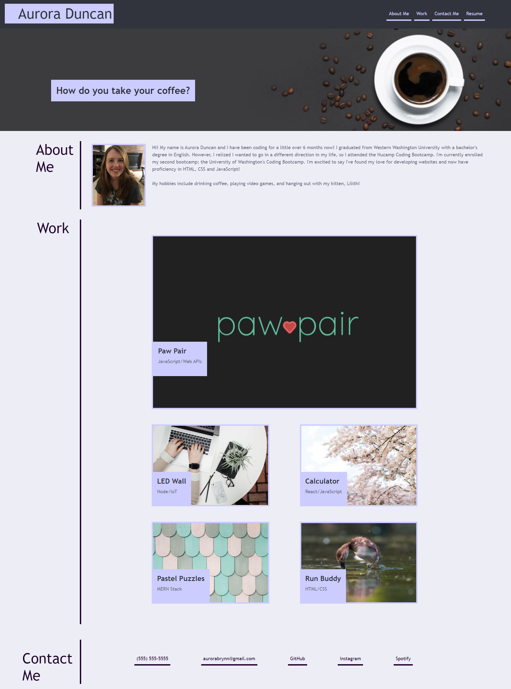

# Code-Refractor

## Description
I made a mock portfolio page based on the markup given. Being able to copy from a markup is important in a web developing job; you could be given a wireframe from a web designer and told to make it a reality. Plus, having a portfolio is important when you are looking for a job. Potential employers can see your previous work and how much you know. They can decide if you would be a good fit for the company based off of your code and potentially your design. 

I learned how to properly format flexboxes, and how useful they can be when making the page responsive to multiple viewpoints.

## Screenshots

## Link
<a href="https://aurorabrynn.github.io/portfolio-markup/">Github Link</a>